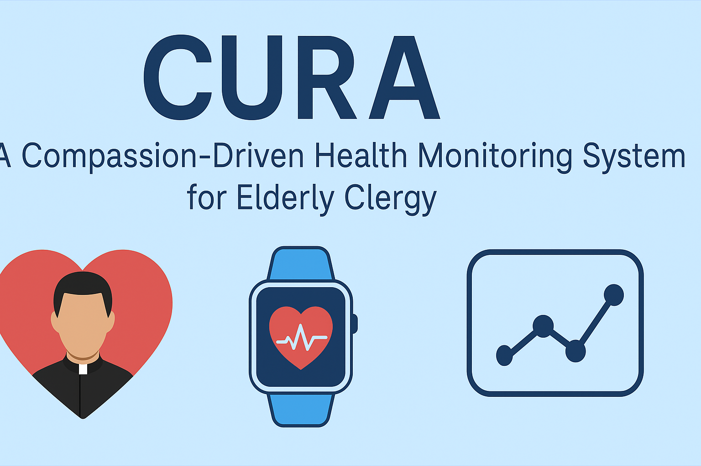

# CURA: A Compassion-Driven Health Monitoring System for Elderly Clergy

<p align="center">
  
</p>


## ✨ About CURA

**CURA** is a Human-Centered Computing (HCC) initiative that integrates technology, ethics, and pastoral sensitivity to monitor and support the health of elderly clergy. Designed by a Catholic priest and data scientist, it captures not just physical metrics but also emotional and spiritual well-being—offering compassionate care through code.

---

## 🎯 Project Goals

- Provide a health dashboard for elderly religious members  
- Predict early signs of health deterioration (e.g., cardiovascular issues)  
- Respect spiritual life and emotional states through daily reflections  
- Design for accessibility: large font, low-tech interfaces, and voice options  
- Center care, privacy, and dignity in all AI decisions

---

## 🧰 Tools Used

| Area | Tools |
|------|-------|
| **Data Analysis** | Python, Pandas, Matplotlib, Seaborn |
| **Modeling** | Scikit-learn, GridSearchCV |
| **Interface** | Streamlit, HTML/CSS (for later deployment) |
| **Data** | Synthetic dataset for 45 elderly clergy over 60 days |
| **Ethics** | Catholic Social Teaching + HCC Design Principles |

---

## 📊 Key Features

- 🧓 Daily logs of mood, heart rate, activity, and spiritual reflections  
- 📈 Predictive model for cardiovascular risk  
- 📉 Visual analysis of health trends  
- 🗣 Voice-based journaling prototype  
- 📜 Ethical whitepaper accompanying the system

---

## 📁 Repository Contents

```
📂 data/         → Synthetic health data (CSV)
📂 notebooks/    → Exploratory analysis + model development
📂 app/          → Streamlit prototype dashboard
📂 reports/      → Charts and documentation
📂 docs/         → Ethics whitepaper and HCC design
📂 figures/      → Mockups, flowcharts
📄 CURA_Health_Data_Analysis.ipynb
📄 CURA_HCC_Ethics_Whitepaper.md
📄 CURA_app.py
📄 README.md
```

---

## 📥 Quick Access

- 📓 [Jupyter Notebook](./CURA_Health_Data_Analysis.ipynb)  
- 📄 [Ethical Design Whitepaper](./CURA_HCC_Ethics_Whitepaper.md)  
- 🖥️ [Streamlit App Code](./CURA_app.py)  
- 📈 [Sample Dataset](./data/cura_45_elderly_health_data.csv)

---

## ✝️ About the Author

**Fr. ND (Nduka Anthony, C.S.Sp.)**  
Catholic Priest • Data Scientist • Advocate for Human-Centered Technology  
Focused on AI for social good, healthcare ethics, and inclusive civic tech.  
[LinkedIn](https://www.linkedin.com/in/tchiemela) • [GitHub](https://github.com/Temela) • tchiemela@gmail.com

---

## 💡 Future Work

- Pilot deployment in religious healthcare settings  
- Expansion to multi-lingual, cross-cultural elderly monitoring  
- Academic publication on CURA in HCI/AI ethics journals

---

> “Use tech to reach the forgotten. Use code to amplify care. Use joy, always.” – Fr. ND
